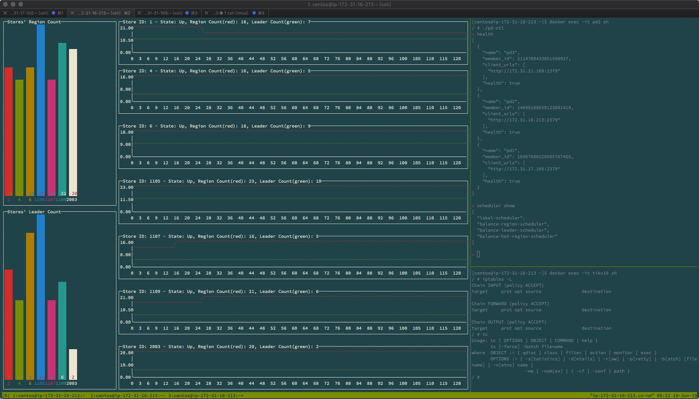

# TiKV Exploring
> Written with [StackEdit](https://stackedit.io/).

This document records some processing and conclusions while exploring the network changes' impact on regions leaders distribution on TiKV clusters.

## Prepare
#### Create TiKV docker image with iptables and tc, Dockerfile
```dockerfile
FROM pingcap/tikv:latest
MAINTAINER cy

RUN apk add -U iptables iproute2

EXPOSE 20160 20180

ENTRYPOINT ["/tikv-server"]
```

#### TiKV should be started with --cap-add
```bash
docker run -d --name tikv10\ 
	-p 20162:20162 \
	--cap-add=NET_ADMIN \
	--cap-add=NET_RAW \
	--ulimit nofile=1000000:1000000 \
	-v /etc/localtime:/etc/localtime:ro \
	-v /home/centos/data2:/data \
	cytikv --addr="0.0.0.0:20162" \
	--advertise-addr="172.31.16.213:20162" \
	--data-dir="/data/tikv10" \
	--pd="172.31.17.105:2379,172.31.16.213:2379,172.31.21.169:2379"
```


## Cluster Intro
* All the services are deployed by docker
* 3 hosts
* Start 3 pd on each host
* Start 3 initial TiKV servers on each host
* Start 1 TiDB server on hostA
* Import [data](https://pingcap.com/docs/dev/how-to/get-started/import-example-database/#download-all-data-files)
* After importing data:
	* region count: 43
	* tikv1 leader count: 15
	* tikv2 leader count: 13
	* tikv3 leader count: 16
* Start another 4 TiKV servers on each host
	* region count: 43
	* tikv1 leader count: 14
	* tikv2 leader count: 12
	* tikv3 leader count: 15
	* region count: 1
	* tikv4 leader count: 1
	* tikv5 leader count: 1
	* tikv6 leader count: 1
	* tikv10 leader count: 1
* Use pd scheduler to balance region and leader distribution
* Start a terminal dashboard to monitor the region and leader distribution `./tidash -p http://127.0.0.1:2379/pd/api/v1`


## Use Cases
All the case you can reproduce on host `172.31.16.213`. Just attach the tmux session with `tmux a`. You'll get a dashboard, a pd-ctl console and a terminal inside tikv10.
1. Ban tivk10 output to access TCP port 2379
	```bash
	iptables -I OUTPUT -p tcp --dport 2379 -j REJECT
	```
	* tikv10 state: `Disconnected`
	* Region and leader count wouldn't change
2. Ban tikv10 output to access TCP port 2380
	```bash
	iptables -F
    iptables -I OUTPUT -p tcp --dport 2380 -j REJECT
    ```
	* tikv10 state: `Up`
	* Region and leader count wouldn't change
3. Ban tikv10 input and output connection with other TiKV servers
	```bash
	iptables -F
    iptables -I OUTPUT -p tcp --dport 20160 -j REJECT
    iptables -I OUTPUT -p tcp --dport 20161 -j REJECT
    iptables -I INPUT -p tcp --dport 20162 -j REJECT
    ```
	* tikv10 state: `Up`
	* Region count wouldn't change, leader count reduce to 0
4. Ban tikv10 all connections, then restore
	```bash
	# ban all connections
	iptables -F
	iptables -I OUTPUT -j REJECT
	iptables -I INPUT -j REJECT
	# restore
	iptables -F
	```
	* tikv10 state: `Disconnected` first then `Up` after restore
	* Region count wouldn't change, leader count reduce to 0
5. Set tikv10 network delay to from 1s to 10s
	```bash
	tc qdisc add dev eth0 root netem delay 9s
	```
	* tikv10 state: `Up`
	* tikv10 leader count reduce to 0 after delay is more than 8s
6. Set tikv10 network package loss rate from 10% to 90%
	```bash
	tc qdisc del dev eth0 root
	tc qdisc add dev eth0 root netem loss 60%
	```
	* tikv10 leader count doesn't change during 10% - 40% loss rate. But tikv10 will start to lose leaders from 60% very quickly. 50% loss rate will trigger leader transfer, but it take much more time than 60% loss rate.
7. Set tikv10 network duplicate rate from 10% -100%
	```bash
	tc qdisc del dev eth0 root
	tc qdisc add dev eth0 root netem duplicate 100%
	```
	* This would not change anything. Guess TCP is good enough to deal with duplicates.
8. Simulate tikv10 network out-of-order
	```bash
	tc qdisc del dev eth0 root
	tc qdisc add dev eth0 root netem delay 10ms reorder 25% 50%
	```
	* Wouldn't change anything.

## Conclusions
1. According TiKV source code [StoreFsmDelegate](https://github.com/tikv/tikv/blob/master/src/raftstore/store/fsm/store.rs#L382), there is a heartbeat StoreMsg from TiKV to PD every 10s by default which you can configure with [pd_store_heartbeat_tick_interval](https://github.com/tikv/tikv/blob/master/src/raftstore/store/config.rs#L165).
2. According to PD source code [storeDisconnectDuration](https://github.com/pingcap/pd/blob/master/server/core/store.go#L403), if the store's lastHeartbeatTS is before 20s, the store's state will be `Disconnected`; And if the store's lastHeartbeatTS is before 30m by default configured by [MaxStoreDownTime](https://github.com/pingcap/pd/blob/master/server/config.go#L567), the store's state will be `Down`.
3. For raftstore, raft_store_max_leader_lease is 9s by default. This may explain Case 5.
4. For raft-rs and raftstore, default election_tick is 20, heartbeat_tick is 2. So after every 20 ticks, there will be an election. If the previous leader can't get votes from other followers during the election, the leader will be changed. Refer to  [tick_election](https://github.com/pingcap/raft-rs/blob/master/src/raft.rs#L782)

## Questions
* For new joined TiKV servers, there was only one region and leader transferred for each TiKV server in a very long time. I have to manually transfer. I'm not sure whether this is because of my cluster setup, all the TiKV servers are on 3 hosts. Need to do some research more.

